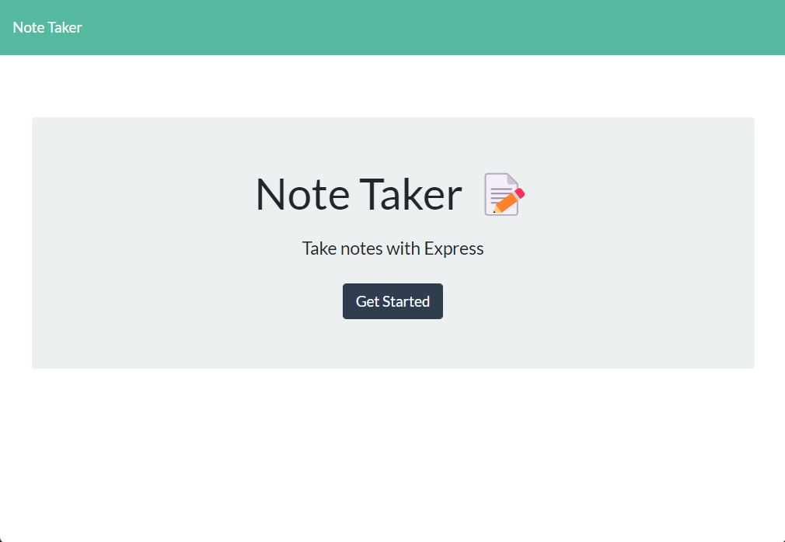
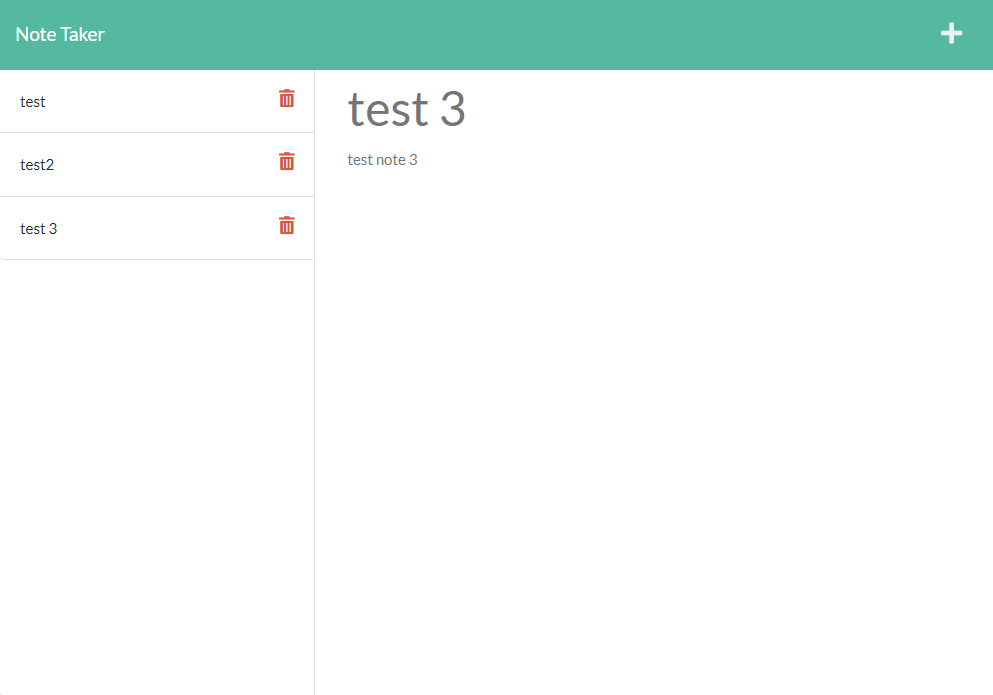

# express.js-note-taker
This application uses express.js to build and organize information saved to a note taking app.
       
  ## Description

  This application allows the user to create notes and add them to a database.

    https://glacial-wave-51267.herokuapp.com/
    
  
  
          
  ## Table of Contents

  * [Installation](#installation)
  * [Usage](#usage)
  * [License](#license)
  * [Contributions](#contributions)
  * [Tests](#tests)
  * [Questions](#questions)
          
  ## Installation

  npm i
          
  ## Usage

  This application is used for personal note taking.
          
  ## License

  
  undefined
  
  undefined 
    
          
  ## Contributions

  No guidlines
          
  ## Tests

  No tests required
          
  ## Questions
  If you have any questions you can find my contact info below.
  * GitHub: [PeteChicchetti](https://github.com/PeteChicchetti)
  * E-mail: petechicchetti@gmail.com